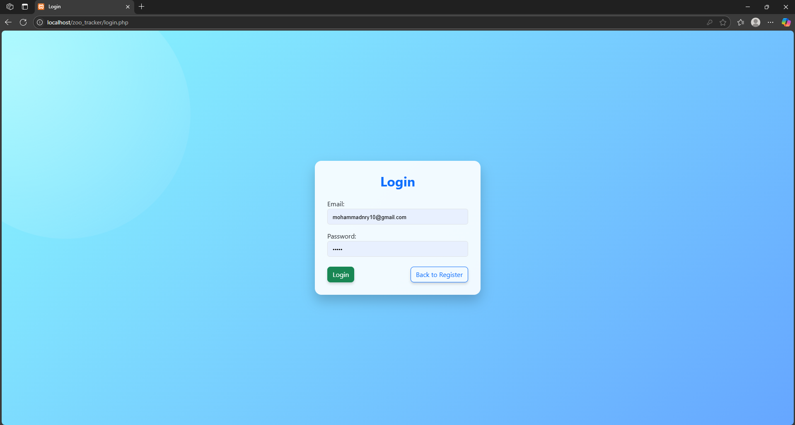

# 🐾 Hayvan Takip Sistemi (Zoo Tracker)

Bu proje, bir hayvanat bahçesindeki hayvanların takibini yapmak ve verilerini yönetmek amacıyla geliştirilmiş web tabanlı bir yönetim panelidir. Kullanıcılar sisteme giriş yaparak hayvanlara ait bilgileri düzenleyebilir, yeni kayıtlar ekleyebilir veya silebilirler.

## 🚀 Kullanılan Teknolojiler
- **PHP** (Yalın, frameworksüz yapı)
- **MySQL (MariaDB)** – PDO ile güvenli bağlantı
- **HTML5 & CSS3**
- **Bootstrap 5.3** – Responsive tasarım
- **JavaScript** (sadece filtreleme ve grafikler için)
- **Chart.js** – Hayvan verileri için görsel grafikler
- **VSCode + XAMPP** – Geliştirme ortamı
- **cPanel & FTP** – Hosting ve canlı yayın ortamı

---

## 🔧 Özellikler

### ✅ Yapılanlar
- 🔐 **Kullanıcı Giriş & Kayıt Sistemi**  
  - Şifreler `password_hash()` ile güvenli şekilde saklanıyor.
  - Oturum kontrolü ile sayfa erişimi yönetiliyor.

- 🐾 **Hayvan Yönetimi (CRUD)**  
  - Hayvan ekleme, düzenleme, silme ve listeleme
  - Her hayvanın adı, türü, cinsiyeti, sağlığı, beslenme bilgisi ve habitatı kaydedilir.

- 📊 **Dinamik Grafikler (Chart.js)**  
  - Cinsiyet dağılımı
  - Tür dağılımı
  - Sağlık durumu grafikleri

- 🎨 **Özgün Stil Dosyası (style.css)**  
  - Tema ve karanlık mod desteği
  - Modern, kullanıcı dostu arayüz

- ☁ **Hosting ve Yayın**  
  - Proje başarıyla uzak sunucuya (FTP üzerinden) aktarılmıştır.
  - `phpMyAdmin` ile veritabanı kurulumu yapılmıştır.

---

### ❌ Henüz Yapılmayanlar / Gelecek Geliştirmeler
- 📧 **Şifre sıfırlama (e-posta destekli)**  
- 🔒 **Rol bazlı yetkilendirme (admin, user)**  
- 📱 **Tam mobil uyumlu görünüm optimizasyonu**  
- 🖼️ **Hayvanlar için fotoğraf yükleme desteği**  
- 🔎 **Gelişmiş filtreleme ve sıralama seçenekleri**  

---

## 🖼️ Ekran Görüntüleri

---

## 🎥 Demo Videosu
📽️ Projeyi çalışırken görmek için:
👉 [Zoo Tracker Tanıtım Videosu]
(https://drive.google.com/file/d/1-ZQQHbsj5i317wZJk_D62MHZGtaQMWiT/view?usp=sharing)

---

## 📁 Klasör Yapısı (Örnek)
